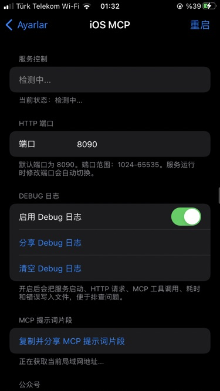
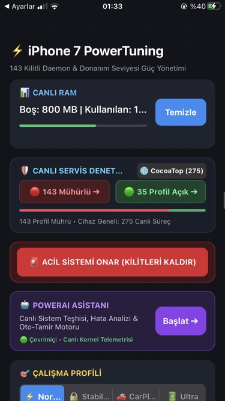

  <h1>🔋 PowerTuning for iOS</h1>
  
<b>Dinamik Sistem Servis Yöneticisi ve Termal Koruma Kalkanı (iOS 15 / Rootless)</b>

  
  
  
  

---

## 📌 Proje Hakkında (Yakında Tamamlanıyor!)
**PowerTuning**, eski iOS cihazlarında (özellikle iPhone 7 gibi RAM ve termal kapasitesi kısıtlı cihazlarda) **Apple'ın arka plan servislerini (daemon) SSV'yi bozmadan dinamik olarak donduran** ve batarya/performans artışı sağlayan bir kontrol merkezidir. 

⚠️ **DUYURU:** Projenin tüm modülleri (PanicGuard, Termal Sensör İzleme, TrollStore TSRootBinaries Entegrasyonu) tamamlanma aşamasındadır. **Çok Yakında Tam Sürüm Yayınlanacaktır!**

## 🚀 Öne Çıkan Veriler ve Özellikler

- **%50 Daha Az Arka Plan CPU Kullanımı:** Rölantide sürekli çalışan `dasd` (Duet Activity) ve `logd` (System Logging) gibi sistem servislerinin arka plan uyanıklığı yarı yarıya indirilir.
- **30+ Servis Mühürlemesi:** `Ultra` moduna geçildiğinde iCloud Senkronizasyonu, Siri Analizleri ve Konum İzleme gibi ağır servisler anında `bootout` ile sistemden (RAM'den) düşürülür. 
- **Donanımsal Olarak Güvenli (FakeFS Gerektirmez):** Servisler fiziksel olarak `/System` dizininden silinmez. Bu sayede Bootloop (Elma logusunda kalma) riski yoktur! Rootless esnekliği ile kalıcı hasar sıfırdır.

## 📸 Ekran Görüntüleri

  
  &nbsp;&nbsp;&nbsp;
  

## 🛡️ Modlar ve İşlevler

| Mod | Durum | İşlev |
|:---:|:---:|:---|
| 🟢 **Normal** | Aktif | Cihazın orijinal halidir. Uygulama kurulurken çekilen 143+ çalışan servis envanterini geri yükler. |
| 🔴 **Ultra** | Aktif | Tam derin uyku modu! Sadece aramalar, SMS ve hücresel ağ çalışır. Gece şarj kaybını minimize eder. |
| 🟡 **CarPlay** | Hazırlanıyor | Araca bağlandığında ısıyı düşürmek için arka planı temizler, sadece harita ve müzik odaklı çalışır. |
| 🔵 **Stabilize**| Hazırlanıyor | Reklam (adprivacyd) ve istatistik servislerini kapatıp günlük dengeli kullanım sağlar. |

## ⚙️ Teknik Altyapı
1. **TSRootBinaries Entegrasyonu:** TrollStore üzerinden kurularak root yetkisi alır (Sudo/nosuid engelini aşar).
2. **Posix Spawn:** Sisteme `system()` üzerinden değil, güvenli C API'si (`posix_spawn`) ile komut gönderilir.
3. **PanicGuard Güvenliği:** Özel yazılan arka plan bekçisi (`panicguard.sh`), `CrashReporter` klasörünü anlık dinler. Kilitlenme algılarsa cihazı anında Normal moda döndürüp korumaya alır!

## 📥 Kurulum (Yakında)
*(Uygulama tam sürüme geçtiğinde buraya `.ipa` indirme linki eklenecektir.)*
